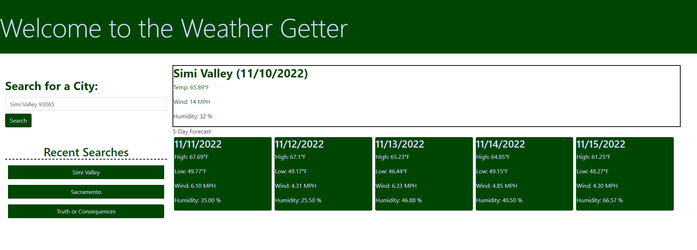

# The Weather Getter

## Badges 

## Description
Want to take a trip? You need to plan for the weather, wherever you're going! 
Just put in the city and zip code you are visiting, and you'll get the forecast for the next five days!

## Built With
- HTML
- CSS
- Javascript
- JQuery
- Bootstrap
- Day.js
- OpenWeather API

## Installation

N/A

## Usage

Visit this web address to see the github deployed page for the repo https://cjmerit.github.io/Weather-Forecaster/

This is an image of the deployed website:

Using chrome as the browser for the web page, right click on it and click inspect to use Chrome DevTools to inspect the html and CSS.